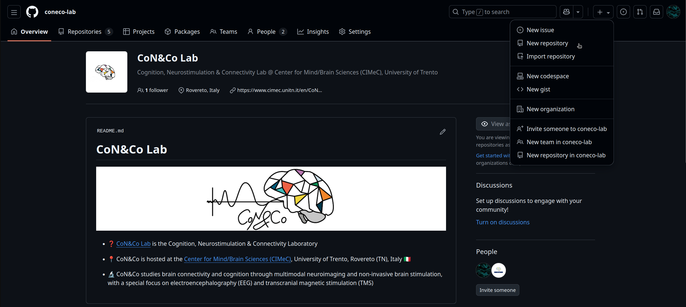
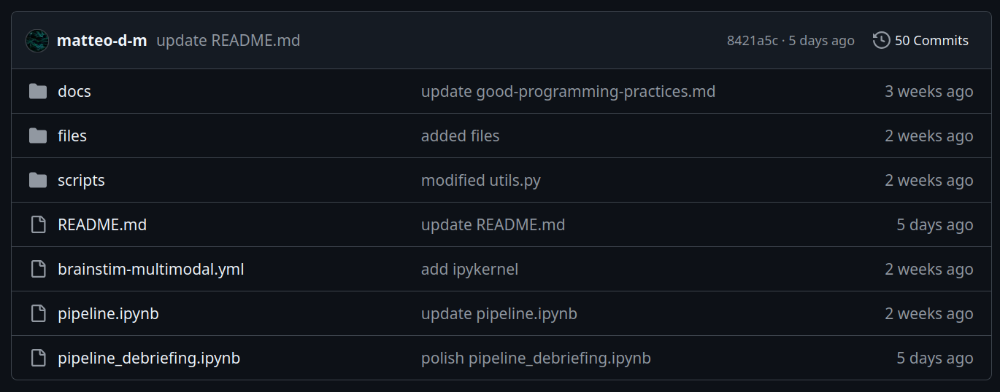
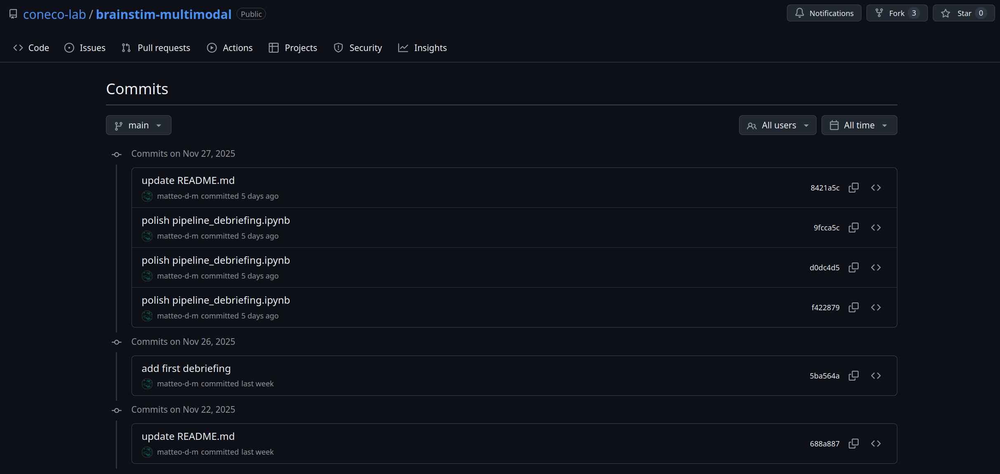
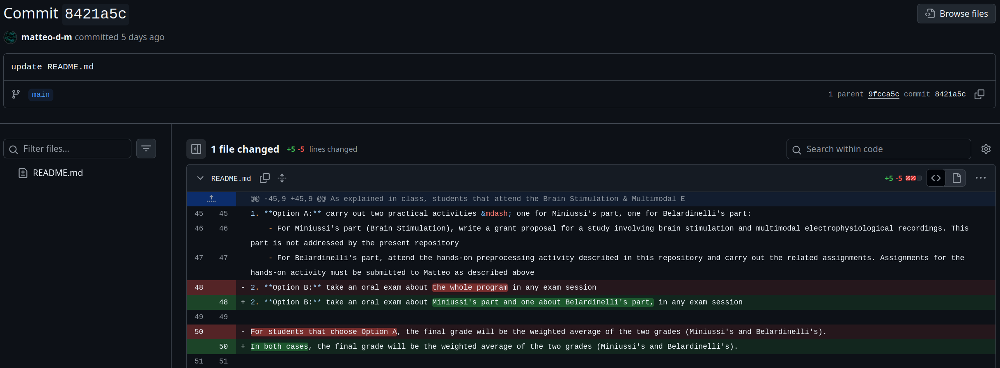
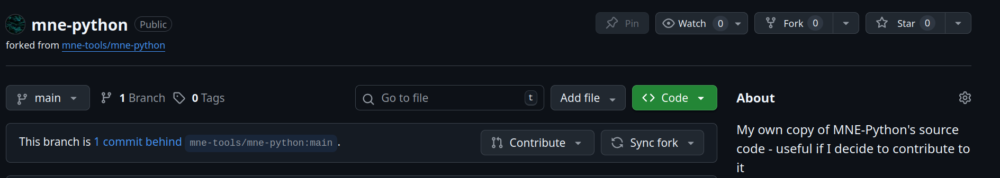

# Version Control With Git & GitHub
This document contains a basic introduction to Git and GitHub. Its aim is to equip absolute beginners with the concepts and tools needed to track code versions in a local repository and interact with remote repositories on GitHub, either alone or in the simple case of collaborating with others from forks. 

## Table of Contents
- [Introduction](#introduction)
- [Core Concepts](#pushpin-core-concepts)
    - [Repository](#pushpin-core-concept-1-repository)
    - [Tracking](#pushpin-core-concept-2-tracking)
    - [Commit](#pushpin-core-concept-3-commit)
    - [Remote](#pushpin-core-concept-4-remote)
    - [Push](#pushpin-core-concept-5-push)
        - [Commit history on GitHub](#point_right-commit-history-on-github)
- [Collaboration Tools](#couple-collaboration-tools)
    - [Forks](#couple-collaborating-1-forks)
    - [Clones](#couple-collaborating-2-clones)
    - [Syncing Forks & Pull Requests](#couple-collaborating-3-syncing-forks-and-pull-requests)
- [Conclusion](#conclusion)

## Introduction
Scientific data analysis can be complex, especially for people that divide their time between different projects. The _conceptual_ complexity of the scientific task adds to the _technical_ complexity of implementing it in a given programming language, which in turn implies preparing and using some computing set-up. If you multiply this complexity for all the projects that you might work on at a given time, things can get out of hand quickly.  

Beside being complex, scientific data analysis tends to be _iterative_ &mdash; that is, it unfolds over a sequence of steps where you continuously try and fail new approaches, progressively adding useful features and removing useless ones from your code. 

One way to handle this complexity is to keep changes explainable and tracked &mdash; that is, to create and use a method that can help users find their way across the data analysis process. 

Traditionally, people have pursued explainability with _logbooks_ and _multiplication_: 

- _Logbooks_ are written documents that summarise the steps taken to carry out a given analysis. Often, logbooks are intended for the private use of the scientist who carries out the analysis. As such, they are usually written with paper and pencil, they are separate from the actual code, they are unaccessible to anyone who wishes to understand the analysis from the outside, and they can easily get lost during events like a transfer from one workplace to another
- _Multiplication_ refers to the practice of multiplying code files to keep track of their versions, inserting information about the version in the filename. For example, the first version of a TMS-EEG preprocessing pipeline can reside in a file named `pipeline_v1.py`, the second in a file named `pipeline_v2.py`, the third in a file named `pipeline_v3.py`, etc. 

While they can be effective for projects that are small and short, logbooks and multiplication have three unforgivable flaws that make them unfit for larger, longer projects:

1. **Scale.** Given the number of attempts that are usually required to go from first to last attempt, multiplication can result in a huge number of files and a correspondingly huge number of entries in a logbook. To avoid having too many files and notes for the same pipeline, people often choose to save only the most meaningful versions, at risk of losing track of some modifications and the exact impact they had on the pipeline
2. **Dispersion.** Logbooks and multiplication tend to disperse information across different media: if we multiply code files and write the reasons in a logbook, the actual modification lives in an entirely different place than the explanation, as the multiplied files live in the computer and the logbook most likely lives in a physical drawer. Even if the logbook is digital, it lives in a different file than the code it refers to &mdash; perhaps even in a different directory
3. **Lack of transparency.** While the final version of a code file has some chances of being published at the end of a project, past versions and logbooks usually rest in a private archive forever. This is a huge limitation in cases when reconstructing the genesis of some code matters &mdash; for example, when someone finds a bug and needs to understand how it came to be
4. **Lack of standard.** There is no universal naming convention for code files, nor for writing logbooks. While seemingly trivial, this is a concrete obstacle on the way to clarity and transparency

The alternative to logbooks and multiplication is to work on a single file and keep track of its different versions in-place using a standardised system like Git. 

> **Git is** a version control system (VCS) &mdash; that is, a software to keep track of the modifications made to other software. 

The name Git is often found in conjunction with GitHub.

> **GitHub is two things:** first, a web service that relies on Git to make multiple users collaborate on the same project while keeping track of everyone's actions, and second, a platform for sharing code and the associated version history with the general public

## :pushpin: Core Concepts
A deep understanding of Git and GitHub can require months of training, but a few minutes of focus are enough to acquire a working knowledge. In particular, a basic use of Git and GitHub relies entirely on 5 simple concepts: _repository_, _tracking_, _commit_, _remote_, and _push_. Once these five concepts are understood, one can add three more (_forks_, _clones_ and _pull request_) to start working collaboratively and unlock a world of possibilities.

The paragraphs below describes all 8 concepts in detail, providing relevant code examples for each one. 

### :pushpin: Core Concept 1: Repository
In version control jargon, a repository is a directory (that is, a folder) whose contents are within the scope of a VCS. If you think of the VCS as a person that looks at a scene, you can think of a repository as any object that falls within the person's visual field and as such, can be touched and manipulated by the person. Similarly, a repository falls within the "visual field" of the VCS, which can thus operate on it. 

Once Git is installed in a computer ([installation link](https://git-scm.com/)), transforming a simple directory into a repository is extremely simple. For example, consider a directory named `git-tutorial`. Imagine this directory is located at `/home/user/Documents/git-tutorial`. In a freshly opened terminal, transforming it into a repository is as simple as:

```bash
mkdir Documents/git-tutorial		# create the directory if not existing yet
cd Documents/git-tutorial	        # go to the directory of interest
git init					        # initialise a Git repository inside it
```
The video below shows the code in action:

[Initializing a Git repository](https://github.com/user-attachments/assets/f2b59f27-596d-4280-bf15-1d8b5630850d)

### :pushpin: Core Concept 2: Tracking
Transforming a directory into a repository does not imply that the VCS will keep track of all its contents: while it can see all the files in the repository, the VCS does not necessarily watch all all of them to record their modifications. In fact, the system only watches the files that have been explicitly added to a tracking list by the owner of the repository. 

To know which files are subject to tracking at any given time, you can use the command `git status` from within you repository. This will print a list of all the files in the directory (including subdirectories), specifying which ones are being tracked and which are not. 

In a newly created repository, no file is being tracked. To start tracking a file of interest, you use command `git add <filename>`. This will add the file to the tracking list and Git will start recording the changes that you make. 

### :pushpin: Core Concept 3: Commit
Usually, files undergo multiple modifications before reaching a satisfying stage. For example, you modify a script multiple times before it works as intended, or you draft multiple versions of a paper before submitting. Not all the modifications made to a file are worth of notice, but some are and must be saved permanently. In version control jargon, those are the modifications you _commit_ &mdash; that is, you make a commitment to keeping them. 

Importantly, committed modifications are accompanied by a _commit message_ &mdash; that is, a short sentence that summarizes what changed between the previous and current commits. For example, if you commit a document called `file.txt` after creating it, your commit message will be something like `"create file.txt"`. 

In practice, creating a commit like the one described above is as simple as:

```bash
git commit file.txt -m "create file.txt"
```

Note that by convention, commit messages are usually written in imperative style: _create_, not _created_; _add_, not _added_; _do_, not _done_; _modify_, not _modified_... etc.

It is worth noting that committing to a modification does not mean that the file cannot be modified any further: it simply means that the VCS will forever record the state of the file at the time of the commit, with a commit message to briefly describe such state and an open possibility to restore it in the future (which will not be treated here).

The video below shows the previous steps in action. First, a file is created with using the Linux command `touch` (you can create the file manually if you do not use a Linux computer). Subsequently, calling `git status` shows that the file exists but is not inside the tracking list. Therefore, the file is added to the tracking list using `git add` and finally, the creation of that file is committed with a corresponding message.

[Print Git status, add to tracking list and commit](https://github.com/user-attachments/assets/b7c1ce30-e638-44db-adb6-72b630f57b7c)

### :pushpin: Core Concept 4: Remote
As described above, a repository is a directory whose contents can be tracked by a VCS. This directory is located inside your own computer, as is the VCS: in other words, the repository is _local_. 

Any local repository can be coupled with a copy hosted on a remote server, which is usually managed by companies like [GitHub](https://github.com/), [GitLab](https://about.gitlab.com/) or [BitBucket](https://bitbucket.org/). The copy hosted on the remote server is the repository's _remote_ and its role is two-fold: on the one hand, provide a back-up for the local copy, and on the other, share the repository with other users (for example colleagues, students or users of a toolbox that you developed). Once you have coupled a local repository with a remote, the two repositories can exchange files _and version histories_ bidirectionally &mdash; and, if you allow them, your collaborators can act on it. 

Adding a remote to a local repository is as simple as: 

```bash
git remote add origin <remote url>
```

Clearly, remotes cannot be added if they do not exist. To create a remote on GitHub, you can create a GitHub account and, once you are logged in, click on the `+` sign on the top-right side of any page. Once you have done that, you can click on `New repository` as in the screenshot below, then follow the instructions on screen. 



Each newly created remote is assigned a URL with the structure `https://github.com/username/repository.git`, which can be copied and used to couple it with a local repository.

For example, creating a repository named `git-tutorial` under user `coneco-lab` would result in the URL `https://github.com/coneco-lab/git-tutorial.git`. With this URL, the command to add a remote looks like the following:

```bash
git remote add origin https://github.com/coneco-lab/git-tutorial.git
```

The video below shows all the steps described in this section, from creating a remote repository on GitHub to coupling it with a local.

[Creating and adding a GitHub remote](https://github.com/user-attachments/assets/13f7c3fb-f347-4e6f-9c6c-90baddce20ff)


### :pushpin: Core Concept 5: Push
Imagine you have a local repository that is coupled to a remote. You have been working on some file in your local and you have finally reached a satisfactory result. Therefore, you commit to your changes and you decide to update the remote. This will change the outdated file on the remote with the updated file from the local, while keeping an explicit trace of the changes that you have made. 

In VCS jargon, updating a remote with newly committed changes is known as _pushing_ your changes to the remote. Pushing a change to a remote is as simple as:

```bash
git push origin main
```

This command means that the `git` VCS should `push` (that is, upload) your changes to `origin`, which is the default identifier given by Git to the remote. These changes shall be pushed to the `main` branch of the repository. 

> _**Note:**_ A branch is one of many sections of a repository. Branches are parallel, independent, and intended for multiple users who work on multiple subtasks within a complex project. In introductory use cases like this one, repositories can be thought of as having a single branch called _main_.

The following video demonstrates a simple push to the remote's main. 

[Pushing to a remote](https://github.com/user-attachments/assets/1f5da25a-473a-4b1c-b966-8a0e5fa43060)

As you can see, pushing to GitHub requires to insert your username (which you choose when you create your account) and a password (which is not shown in the terminal for privacy). 

> Note: GitHub has recently implemented a new security policy that forces users to authenticate with _personal access tokens_ (instead of simple passwords) when carrying out repository operations from the terminal. Personal access tokens are basically random sequences of letters and numbers, with an expiration date. GitHub generates tokens upon request, and you can use them to authorize repository operations until their expiration date. The difference between tokens and the standard GitHub password is that the tokens are needed for repository operations in the terminal, while the standard password is needed to log into your GitHub account. You can go [here](https://docs.github.com/en/authentication/keeping-your-account-and-data-secure/managing-your-personal-access-tokens) for detailed information about access tokens, and [here](https://docs.github.com/en/authentication/keeping-your-account-and-data-secure/managing-your-personal-access-tokens#creating-a-personal-access-token-classic) to create a basic one.

#### :point_right: Commit history on GitHub
If you navigate to any public repository on GitHub (for example, [this one](https://github.com/coneco-lab/brainstim-multimodal)) you will see a panel like the following:



This panel shows a list of the repository's contents (on the left), each one with the latest commit message (in the center) and the date they were last pushed to the remote (on the right): for example, file `pipeline_debriefing.ipynb` (the last one in the list) was last committed with a message that said `polish pipeline_debriefing.ipynb`, indicating that the last modification applied to the file was a mere polishing (that is, honing minor flaws). Such last modification was pushed to the remote 5 days ago (at the time of writing). 

Beside the list of files with the latest commits and push times, the panel contains two other important pieces of information, both located in the upper strip: 


The first piece of information concerns the latest commit, which was pushed by user `matteo-d-m` (in this case, the owner of the repository) with the commit message `update README.md`. Git assigned the commit a unique identifier (visible on the right side of the strip), which is `8421a5c` and can be used to revert subsequent file versions to the present state. 

The second piece of information is right next to the commit's identifier, and it is the total number of commits that were pushed to the remote (in this case, 50). Clicking on it opens a list of all commits with the corresponding message and unique identifiers, as follows: 



Each item of this list can be inspected closely by clicking on it. This will open the raw contents of the file, where deletions will be highlighted in red and marked by a "minus" sign, while additions will be highlighted in green and marked by a "plus" sign:



Here lies the power of Git and GitHub: Git keeps track of all changes, line by line, and assigns them a unique identifier once you decide to commit. Downstream, GitHub keeps a back-up of all those changes in the cloud, preserving them in case you lose access to your local and making them available to the general public if you want to. 

## :couple: Collaboration Tools
### :couple: Collaborating 1: Forks
The workflow described thus far depicts a scenario where you first create a local repository, and then couple it with a remote. This assumes that you are starting a project from scratch and you want to have a remote back-up or to share it with other people. 

A different, but equally common scenario is that you work on a project that has been started and published by someone else. For example you might jump in on a project started by a colleague, have your own copy of the materials for a hands-on activity, or contribute to a Python library. In these cases, you should start by _forking_ the GitHub repository of interest. 

Forking creates a copy of a GitHub repository that was created by another user. When you fork someone's repository, you are copying all its contents and the associated version history and pasting them inside your user account. Your copy will be called the _fork_ and the original repository will be called the _upstream_. The fork will live in parallel to the upstream and idependently from it, so changes made to either will not affect the other.

The video below demonstrates forking MNE's GitHub repository into my own user account:

[Forking a GitHub remote](https://github.com/user-attachments/assets/71d137fb-91c2-4776-8873-9fb93c7977ce)

### :couple: Collaborating 2: Clones
Creating a fork on GitHub is not enough to start working on it: to do so, you need to pair it with a local. 

To pair any existing remote (including a fork) with a new local you need to _clone_ it. Cloning a remote creates a local copy of it, downloading all the files of the repository and their version histories to your computer. 

A clone is a full-blown repository that inherits the version history of the corresponding remote, such that your own commits will be appended to the existing history that was created by previous users. Nonetheless, your commits can be pushed freely because the remote is yours and it is completely independent from the original that you forked. Moreover, you do not need to run `git remote add origin`, as the pairing with the remote was done at the moment of cloning.  

The following video demonstrates cloning MNE-Python's GitHub repository into a local, which I arbitrarily decide to put inside directory `Documents`. As can be seen, running `git status` after cloning returns a meaningful result (and not an error), which implies that cloning returned a proper repository and not a simple folder. Subsequently, running Linux command `ls` prints a list of the repository's contents, which indeed are the same as the remote's. 

> Note 1: if you do not use Linux, you can print a list of a a repository's (or directory's) contents using `ls` (if Mac) or `dir` (if Windows).

> Note 2: if you clone a repository that contains something that can be installed (like MNE-Python), you are not actually performing the installation: you are merely creating a local copy of the installable code 

[Cloning a remote](https://github.com/user-attachments/assets/32b0ceea-db2f-4e06-9f4f-de335327f940)

### :couple: Collaborating 3: Syncing Forks and Pull Requests
By default, any change applied to the upstream does not affect its forks. However, GitHub constantly keeps track of all the changes made to the upstream and its forks, compares their version histories to see if they align, and warns users if they do not. For example, changes in the upstream are signalled  by a message that appears on top of any fork and says `This branch is <number> commits behind <name of the upstream>`. This is shown in the screenshot below,, where my fork of MNE-Python is 1 commit behind of the upstream, which is `mne-tools/mne-python:main` (that is, the `main` branch of repository `mne-python` by user `mne-tools`):



If you make some local commits and push them to the fork, the message will read `This branch is <number> commits ahead of and <number> commits behind <name of the upstream>` . 

If you want to enjoy all the changes made to the upstream after you forked it, you need to _synchronize_ your fork by pressing the `Sync fork` button (see screenshot above). Doing so will take the upstream changes into your fork but will not take your fork's changes into the upstream. This ensures that authors of a fork can stay up-to-date with the upstream while they try adding new features, but the upstream remains stable and does not incur a risk of breaking because of inappropriate changes.   

If you want your changes incorporated into the upstream, you need to submit a _pull request_ to it. A pull request is a request to the owner of the upstream to review and incorporate your changes. The owner of the upstream is free to accept or decline the pull request, and the owner of the fork has no way to force the process. To submit a pull request, you can press on the `Contribute` button that is located next to `Sync fork` (see above).

## Conclusion
Using a version control system like Git allows anyone who writes code to keep a history of their work, with a timestamp, a unique identifier and a verbal description for all its different versions. This eliminates the need to keep one file for each version and a separate logbook to track them all, thus simplifying data analysis workflows and making them more reproducible. 

Achieving full mastery of version control systems can require months of training, but beginners can be greatly empowered by the handful of concepts described in this introductory tutorial. Interested readers can refer to the official [Git](https://git-scm.com/book/en/v2) and [GitHub](https://docs.github.com/) documentations to expand their knowledge beyond the basics. For the others, the contents of this page should be enough to start practicing version control and enjoy the possibilities it offers. 

---

**Matteo De Matola**

Center for Mind/Brain Sciences (CIMeC), University of Trento

[University homepage](https://webapps.unitn.it/du/en/Persona/PER0247884/Curriculum) | [GitHub](https://github.com/matteo-d-m)

December 2025


